# Laboratorio 2. TP 2

## Simulador de Truco MMN448

### Resumen:

La aplicación funciona como un sistema de simulación de partidas de truco, en las que un administrador podrá crear partidas seleccionando a los respectivos usuarios y generando la nueva partida.
En un Datagrid de menú principal se podra ver la partida que está corriendo, y al seleccionarla se activará el botón de ver partida que permitirá ver la respectiva partida. 
También cuenta con un botón de estadísticas que permitira ver las partidas jugadas, los ganadores y los perdedores de las mismas.

### Diagrama de clases:

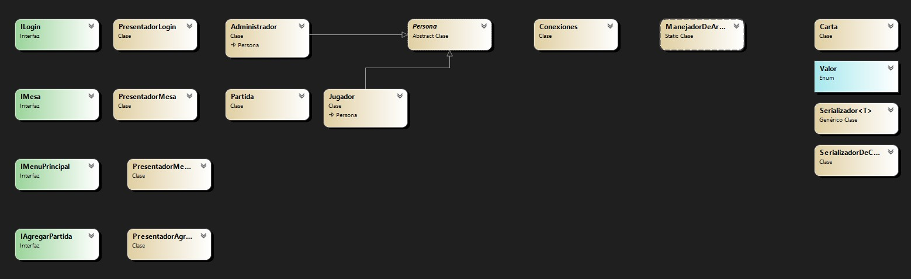

### Justificaci�n t�nica:

#### Interfaces

Se utilizan las interfaces y presentador con el modelo mvp para gestionar los formularios, dejando la lógica por fuera de los mismos

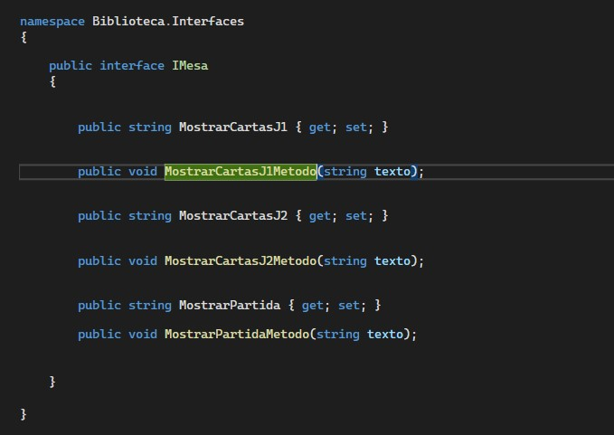

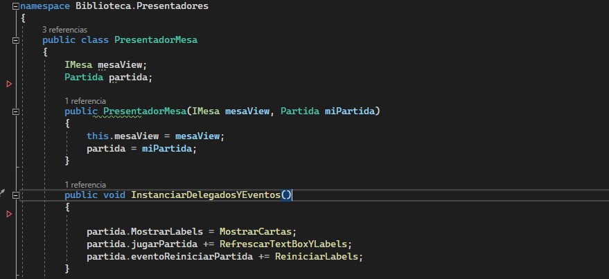

#### Delegados y Eventos

Se utilizan distintos Eventos y Delegados para ejecutar varios métodos juntos, para mostrar información de la pantalla y para mantener los métodos ocultos.

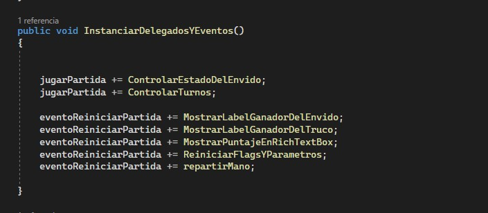

#### Task

Se utilizan las Task para poder correr partidas simulteamente

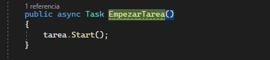

#### SQL

Se utiliza SQL para realizar la conexión a la base de datos, para cargar la lista de jugadores, de administrador, de partidas, para guardar los datos de las partidas y actualizar los datos de los jugadores.

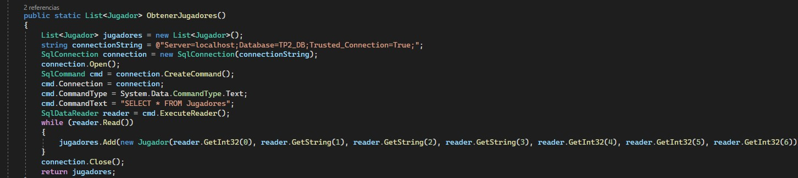

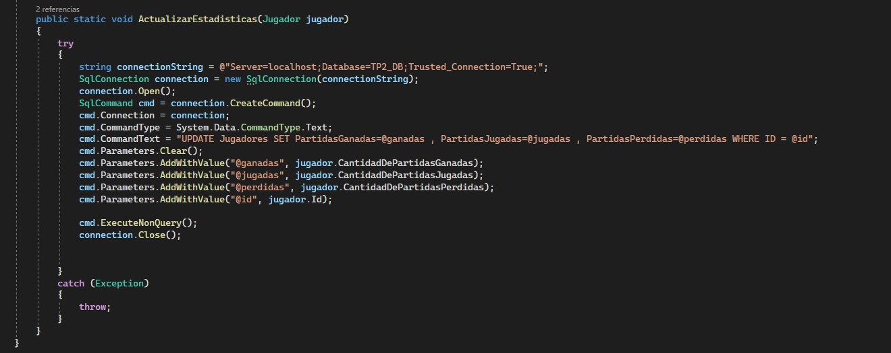

#### Manejo de excepciones

Se utilizan distintos try catchs para contener posibles excepciones en el código

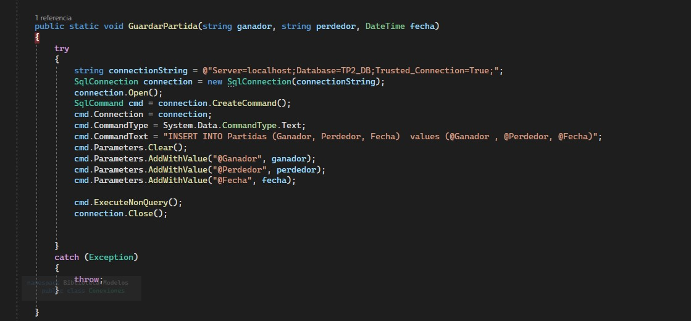

#### Generics

Se utilizan los generics en el serializador para poder serializar cualquier tipo de dato.

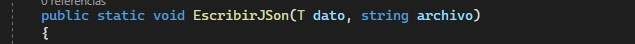

#### Serialización 

Se utiliza la serialización para guardar y cargar el mazo de cartas desde un archivo json

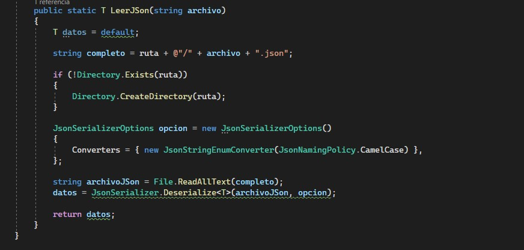

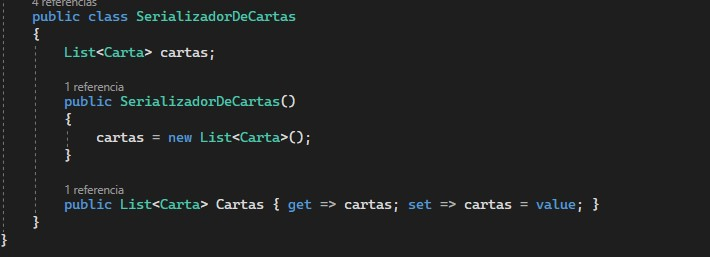

####  Escritura de archivos

Se utiliza la escritura de arhivos para guardar Los chats de las partidas jugadas en la carpeta LogsPartidas

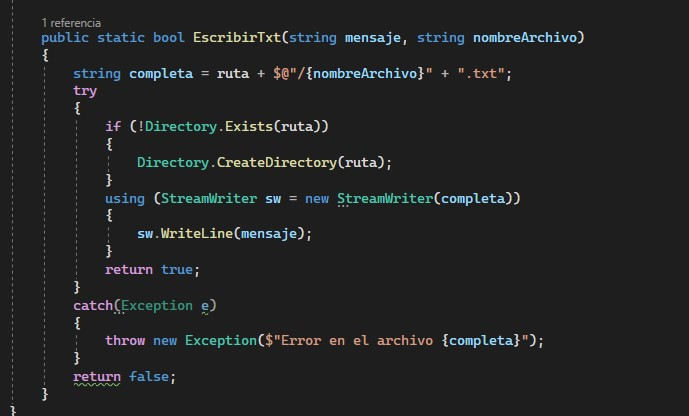

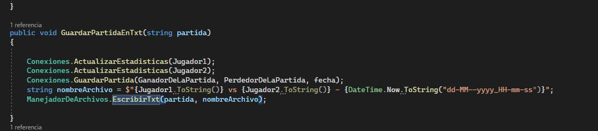

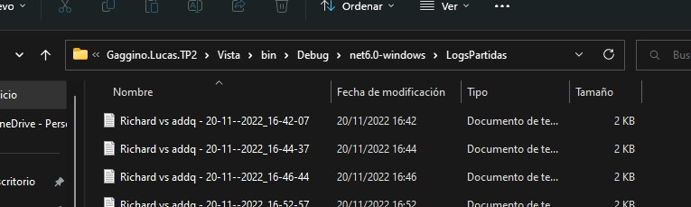

# TP2_LABORATORIO2